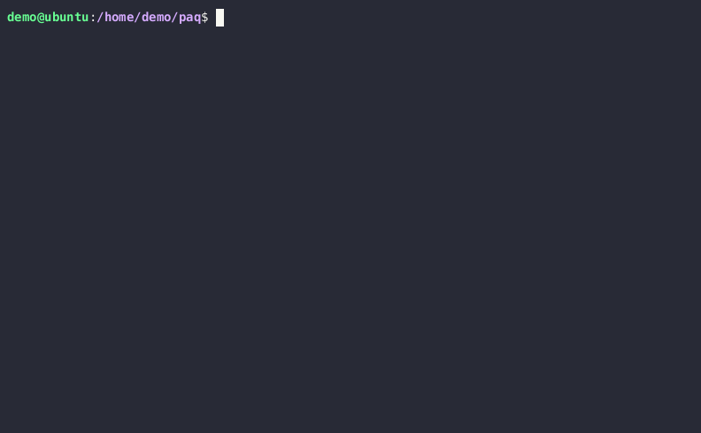

[](https://github.com/gregl83/paq/actions/workflows/build.yml)
[](https://codecov.io/gh/gregl83/paq)
[](https://crates.io/crates/paq)
[](https://github.com/gregl83/paq/blob/master/LICENSE)

# paq

Hash file or directory recursively.

Powered by `blake3` cryptographic hashing algorithm.

<p align="center">
  
</p>

## Performance

The [go](https://github.com/golang/go/commit/8b5fe5980cc116366b37ed8aa83569cadf5772d0) programming language repository was used as a test case (478 MB / 12,540 files).

| Tool               | Command                  |     Mean [ms] | Min [ms] | Max [ms] |     Relative |
| :----------------- | :----------------------- | ------------: | -------: | -------: | -----------: |
| [paq][paq]         | `paq ./go`               |   116.4 ± 2.6 |    111.4 |    120.9 |         1.00 |
| [b3sum][b3sum]     | `shell b3sum`            |   132.4 ± 1.5 |    129.6 |    135.9 |  1.14 ± 0.03 |
| [dirhash][dirhash] | `dirhash -a sha256 ./go` |   642.5 ± 5.8 |    634.7 |    649.8 |  5.52 ± 0.13 |
| [GNU sha2][gnusha] | `shell sha256sum`        | 1583.0 ± 16.3 |   1568.6 |   1606.8 | 13.60 ± 0.33 |

[paq]: https://github.com/gregl83/paq
[b3sum]: https://github.com/BLAKE3-team/BLAKE3/tree/master/b3sum
[dirhash]: https://github.com/idrassi/DirHash
[gnusha]: https://manpages.debian.org/testing/coreutils/sha256sum.1.en.html

Performance [benchmark](benches/hyperfine.sh) uses [hyperfine](https://github.com/sharkdp/hyperfine).

Commands with `shell` use the following command with various `<hashsum>` implementations:

```bash
find ./go -type f -print0 | LC_ALL=C sort -z | xargs -0 <hashsum> | <hashsum>
```

## Installation

### Cargo Install

Installation requires [cargo](https://doc.rust-lang.org/cargo/getting-started/installation.html).

#### Install From Crates.io

```bash
cargo install paq
```

#### Install From Repository Clone (Unstable)

Not recommended due to instability of `main` branch in-between releases.

1. Clone this repository.
2. Run `cargo install --path .` from repository root.

### Nix Flakes

Installation requires [nix](https://nix.dev/) and the `nix-command` [experimental feature](https://nixos.wiki/wiki/Flakes#Enable_flakes_temporarily) to be enabled.

```bash
nix profile add github:gregl83/paq
```

### Pre-Built Binary Package

1. Find [Latest Release](https://github.com/gregl83/paq/releases) `.zip` archive for computer Operating System and Architecture.
2. Download and extract `.zip`.
3. Modify permissions of the extracted `paq` binary to allow execution.
4. Move `paq` to a system path.

## Usage

Command Line Interface executable or Crate library.

Included in this repository is an [example directory](./example) containing some sample files, a subdirectory and a symlink to test `paq` functionality.

### Executable

Run `paq [src]` to hash source file or directory.

Output hash to `.paq` file as valid JSON.

For help, run `paq --help`.

#### Hash Example Directory

```bash
paq ./example
```

Path to example directory can be relative or absolute.

Expect different results if `-i` or `--ignore-hidden` flag argument is used.

### Crate Library

Add `paq` to project [dependencies](https://doc.rust-lang.org/cargo/reference/specifying-dependencies.html#specifying-dependencies-from-cratesio) in `Cargo.toml`.

#### Use Library

```rust
use paq;

let source = std::path::PathBuf::from("/path/to/source");
let ignore_hidden = true; // .dir or .file
let source_hash: paq::ArrayString<64> = paq::hash_source(&source, ignore_hidden);

println!("{}", source_hash);
```

#### Hash Example Directory

```rust
use paq;

let source = std::path::PathBuf::from("example");
let ignore_hidden = true;
let source_hash: paq::ArrayString<64> = paq::hash_source(&source, ignore_hidden);

assert_eq!(&source_hash[..], "a593d18de8b696c153df9079c662346fafbb555cc4b2bbf5c7e6747e23a24d74");
```

Expect different results if `ignore_hidden` is set to `false`.

## Content Limitations

Hashes are generated using file system content as input data to the `blake3` hashing algorithm.

By design, `paq` does NOT include file system metadata in hash input such as:

- File modes
- File ownership
- File modification and access times
- File ACLs and extended attributes
- Hard links
- Symlink target contents (target path is hashed)

Additionally, files or directory contents starting with dot or full stop _can_ optionally be ignored.

## How it Works

1. Recursively get path(s) for a given source argument.
2. Hash each path and file contents if path is to a file.
3. Sort the list of hashes for consistent ordering.
4. Compute the final hash by hashing the list of hashes.

## License

[MIT](LICENSE)
