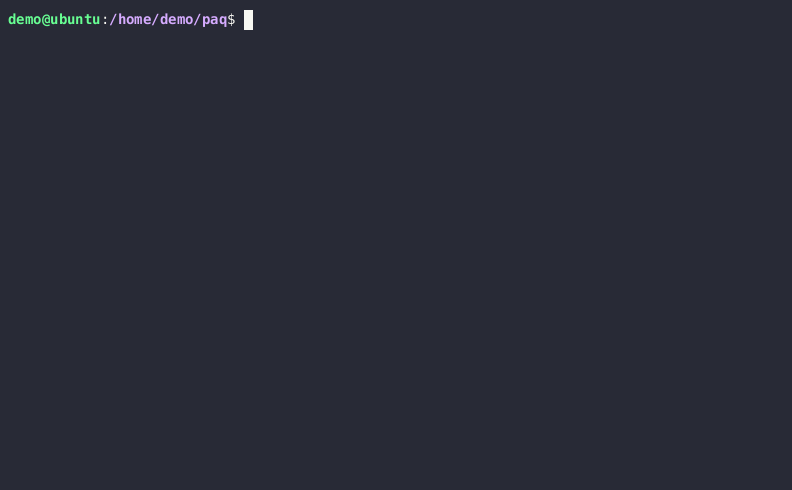

[](https://github.com/gregl83/paq/actions/workflows/ci.yml)
[](https://codecov.io/gh/gregl83/paq)
[](https://crates.io/crates/paq)
[](https://github.com/gregl83/paq/blob/master/LICENSE)

# paq

Hash a directory or file with `BLAKE3`.

<p align="center">
  
</p>

## Performance

The [Go](https://github.com/golang/go/commit/6e676ab2b809d46623acb5988248d95d1eb7939c) programming language repository was used as a test data source (157 MB / 14,490 files).

| Tool                       | Version | Command                   |     Mean [ms] | Min [ms] | Max [ms] |     Relative |
| :------------------------- | :------ | :------------------------ | ------------: | -------: | -------: | -----------: |
| [paq][paq]                 | latest  | `paq ./go`                |    77.7 ± 0.6 |     77.1 |     80.2 |         1.00 |
| [b3sum][b3sum]             | 1.5.1   | `find ./go ... b3sum`     |   327.3 ± 3.6 |    320.2 |    332.3 |  4.21 ± 0.05 |
| [dirhash][dirhash]         | 0.5.0   | `dirhash -a sha256 ./go`  |   576.1 ± 2.9 |    570.8 |    580.3 |  7.41 ± 0.06 |
| [GNU sha2][gnusha]         | 9.7     | `find ./go ... sha256sum` |  725.2 ± 43.5 |    692.2 |    813.2 |  9.33 ± 0.56 |
| [folder-hash][folder-hash] | 4.1.1   | `folder-hash ./go`        | 1906.0 ± 78.0 |   1810.0 |   2029.0 | 24.53 ± 1.02 |

[paq]: https://github.com/gregl83/paq
[b3sum]: https://github.com/BLAKE3-team/BLAKE3/tree/master/b3sum
[gnusha]: https://manpages.debian.org/testing/coreutils/sha256sum.1.en.html
[dirhash]: https://github.com/andhus/dirhash-python
[folder-hash]: https://github.com/marc136/node-folder-hash

See [benchmarks](docs/benchmarks.md) documentation for more details.

## Installation

### Quick Install

Install the latest release on Linux (x86/x64 with glibc) or macOS (Intel/Apple Silicon):

```bash
curl --proto '=https' --tlsv1.2 -fsSL https://raw.githubusercontent.com/gregl83/paq/main/install.sh | sh
```

Installs to `~/.local/bin`; add it to your `PATH` if needed.

### Cargo

With the Rust toolchain installed:

```bash
cargo install paq
```

[Download prebuilt binaries](https://github.com/gregl83/paq/releases/latest) for Windows, macOS, and Linux, or see the [installation guide](docs/install.md) for manual downloads, Nix, and installer options.

## Bindings and Integrations

Use `paq` for BLAKE3 directory and file hashing in other languages and build tools:

- [paqpy](https://pypi.org/project/paqpy/): Python bindings. [Source](https://github.com/gregl83/paqpy).
- [@paqjs/core](https://www.npmjs.com/package/@paqjs/core): Node.js bindings for JavaScript and TypeScript. [Source](https://github.com/gregl83/paqjs).
- [bazel_paq](https://registry.bazel.build/modules/bazel_paq): Bazel aspect for hashing build target outputs. [Source](https://github.com/gregl83/bazel-paq).

## Usage

Command Line Interface executable or Crate library.

Included in this repository is an [example directory](./example) containing some sample files, a subdirectory and a symlink to test `paq` functionality.

### Executable

Run `paq [src]` to hash source file or directory.

Output hash to `.paq` file as valid JSON.

For help, run `paq --help`.

#### Hash Example Directory

```bash
paq ./example
```

Path to example directory can be relative or absolute.

Expect different results if `-i` or `--ignore-hidden` flag argument is used.

### Crate Library

Add `paq` to project [dependencies](https://doc.rust-lang.org/cargo/reference/specifying-dependencies.html#specifying-dependencies-from-cratesio) in `Cargo.toml`.

#### Use Library

```rust
use paq;

let source = std::path::PathBuf::from("/path/to/source");
let ignore_hidden = true; // .dir or .file
let source_hash: paq::ArrayString<64> = paq::hash_source(&source, ignore_hidden);

println!("{}", source_hash);
```

#### Hash Example Directory

```rust
use paq;

let source = std::path::PathBuf::from("example");
let ignore_hidden = true;
let source_hash: paq::ArrayString<64> = paq::hash_source(&source, ignore_hidden);

assert_eq!(&source_hash[..], "2d7ba6963c4836dcbd679607bc432afce5e3c4ef1dc0bed145c20d1b8e2bda77");
```

Expect different results if `ignore_hidden` is set to `false`.

## Content Limitations

Hashes are generated using file system content as input data to the `BLAKE3` hashing algorithm.

By design, `paq` does NOT include file system metadata in hash input such as:

- File modes
- File ownership
- File modification and access times
- File ACLs and extended attributes
- Hard links
- Symlink target contents (target path is hashed)

Additionally, files or directory contents starting with dot or full stop _can_ optionally be ignored.

## How it Works

1. **Stream & Hash:** Recursively discovers source system path(s) and hashes them in a parallel pipeline.
2. **Sort:** Orders the hashes to ensure a deterministic output.
3. **Finalize:** Computes the final hash by hashing the list of hashes.

Each entry hashes its relative path, a NUL byte (`0x00`), a type byte, and its
payload. The NUL and type bytes are passed to the hasher together. Type bytes are `0x01` for files, `0x02` for directories, `0x03` for
symlinks, and `0x04` for other filesystem entries. File payloads are contents;
symlink payloads are target paths. Directories and other entries have no payload.
Paths use `/` separators on Windows.

## License

[MIT](LICENSE)
