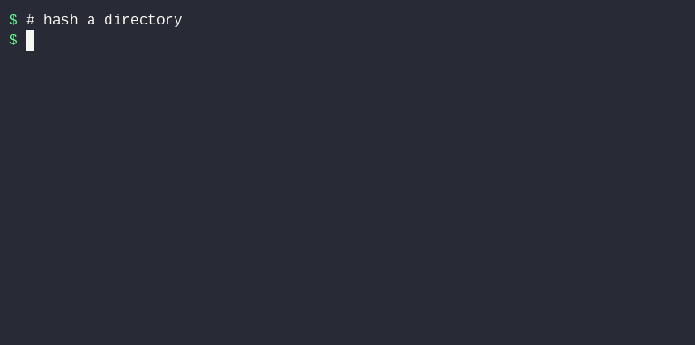

[](https://github.com/gregl83/paq/actions/workflows/ci.yml)
[](https://codecov.io/gh/gregl83/paq)
[](https://crates.io/crates/paq)
[](https://github.com/gregl83/paq/blob/master/LICENSE)

# paq

Hash a directory or file with `BLAKE3`.

<p align="center">
  
</p>

## Performance

The [Go](https://github.com/golang/go/commit/6e676ab2b809d46623acb5988248d95d1eb7939c) programming language repository was used as a test data source (157 MB / 14,490 files).

| Tool                                     | Version | Command                                 |     Mean [ms] | Min [ms] | Max [ms] |     Relative |
| :--------------------------------------- | :------ | :-------------------------------------- | ------------: | -------: | -------: | -----------: |
| [paq][paq]                               | 2.0.0   | `paq ./go`                              |    30.0 ± 0.3 |     29.3 |     30.6 |         1.00 |
| [GNU md5sum][gnumd5]                     | 9.11    | `fd ... ./go ... md5sum`                |    90.6 ± 6.9 |     79.6 |    102.6 |  3.02 ± 0.23 |
| [merkle_hash][merkle_hash]               | 3.9.0   | `merkle-hash ./go`                      |   98.7 ± 27.4 |     36.1 |    138.6 |  3.29 ± 0.91 |
| [b3sum][b3sum]                           | 1.5.1   | `fd ... ./go ... b3sum`                 |   114.1 ± 3.6 |    108.3 |    119.5 |  3.80 ± 0.13 |
| [GNU sha2][gnusha]                       | 9.11    | `fd ... ./go ... sha256sum`             |  155.3 ± 11.7 |    140.1 |    191.2 |  5.17 ± 0.40 |
| [directory-checksum][directory-checksum] | 1.4.20  | `directory-checksum --max-depth=0 ./go` |   386.5 ± 2.0 |    382.8 |    389.1 | 12.87 ± 0.15 |
| [checksumdir][checksumdir]               | 1.3.0   | `checksumdir -a sha256 ./go`            |   453.9 ± 6.8 |    447.3 |    471.0 | 15.11 ± 0.28 |
| [dirhash][dirhash]                       | 0.5.0   | `dirhash -a sha256 ./go`                |   570.0 ± 3.3 |    565.2 |    575.8 | 18.98 ± 0.23 |
| [folder-hash][folder-hash]               | 4.1.1   | `folder-hash ./go`                      | 1407.0 ± 49.0 |   1318.0 |   1497.0 | 46.86 ± 1.72 |
| [Hashrat][hashrat]                       | 1.25    | `hashrat -sha256 -dir -hidden ./go`     |  2076.0 ± 6.0 |   2065.0 |   2084.0 | 69.12 ± 0.77 |

[paq]: https://github.com/gregl83/paq
[merkle_hash]: https://github.com/hristogochev/merkle_hash
[directory-checksum]: https://github.com/MShekow/directory-checksum
[hashrat]: https://github.com/ColumPaget/Hashrat
[checksumdir]: https://pypi.org/project/checksumdir/
[b3sum]: https://github.com/BLAKE3-team/BLAKE3/tree/master/b3sum
[gnumd5]: https://www.gnu.org/software/coreutils/manual/html_node/md5sum-invocation.html
[gnusha]: https://manpages.debian.org/testing/coreutils/sha256sum.1.en.html
[dirhash]: https://github.com/andhus/dirhash-python
[folder-hash]: https://github.com/marc136/node-folder-hash

See [benchmarks](docs/benchmarks.md) documentation for more details.

## Installation

### Quick Install

Install the latest release on Linux (x86/x64 with glibc) or macOS (Intel/Apple Silicon):

```bash
curl --proto '=https' --tlsv1.2 -fsSL https://raw.githubusercontent.com/gregl83/paq/main/install.sh | sh
```

Installs to `~/.local/bin`; add it to your `PATH` if needed.

### Cargo

With the Rust toolchain installed:

```bash
cargo install paq
```

[Download prebuilt binaries](https://github.com/gregl83/paq/releases/latest) for Windows, macOS, and Linux, or see the [installation guide](docs/install.md) for manual downloads, Nix, and installer options.

## Bindings and Integrations

Use `paq` for BLAKE3 directory and file hashing in other languages and build tools:

- [paqpy](https://pypi.org/project/paqpy/): Python bindings. [Source](https://github.com/gregl83/paqpy).
- [@paqjs/core](https://www.npmjs.com/package/@paqjs/core): Node.js bindings for JavaScript and TypeScript. [Source](https://github.com/gregl83/paqjs).
- [bazel_paq](https://registry.bazel.build/modules/bazel_paq): Bazel aspect for hashing build target outputs. [Source](https://github.com/gregl83/bazel-paq).

## Usage

Command Line Interface executable or Crate library.

Included in this repository is an [example directory](./example) containing some sample files, a subdirectory and a symlink to test `paq` functionality.

### Executable

Run `paq [src]` to hash source file or directory.

Output hash to `.paq` file as valid JSON.

For help, run `paq --help`.

#### Hash Example Directory

```bash
paq ./example
```

Path to example directory can be relative or absolute.

Use `-i` / `--ignore-hidden` to omit hidden entries.

Use `-L` / `--follow` to hash symbolic-link targets and traverse linked
directories, including targets outside the source tree. Broken links and cycles
return an error. Link following defaults to false: links are hashed by their
target-path text, including when the source itself is a symbolic link.
These options can change the resulting hash.

### Crate Library

Add `paq` to project [dependencies](https://doc.rust-lang.org/cargo/reference/specifying-dependencies.html#specifying-dependencies-from-cratesio) in `Cargo.toml`.

`hash_source` hashes a file or directory, with options to ignore hidden entries
and follow symbolic links. Errors are returned as `paq::Error`.

#### Use Library

```rust
use paq;

fn main() -> Result<(), paq::Error> {
    let source = std::path::PathBuf::from("/path/to/source");
    let ignore_hidden = true; // .dir or .file
    let follow_links = false;
    let source_hash = paq::hash_source(&source, ignore_hidden, follow_links)?;

    println!("{}", source_hash);
    Ok(())
}
```

## Content Limitations

Files must remain unchanged during hashing; modifying memory-mapped files can cause undefined behavior, including crashes.

Hashes are generated using file system content as input data to the `BLAKE3` hashing algorithm.

By design, `paq` does NOT include file system metadata in hash input such as:

- File modes
- File ownership
- File modification and access times
- File ACLs and extended attributes
- Hard links
- Symlink target contents unless `--follow` is enabled (otherwise the target path is hashed)

Additionally, files or directory contents starting with dot or full stop _can_ optionally be ignored.

## How it Works

1. **Stream & Hash:** Recursively discovers source system path(s) and hashes them in a parallel pipeline.
2. **Sort:** Orders the hashes to ensure a deterministic output.
3. **Finalize:** Computes the final hash by hashing the list of hashes.

Each entry hashes its relative path, a NUL byte (`0x00`), a type byte, and its
payload. The NUL and type bytes are passed to the hasher together. Type bytes are `0x01` for files, `0x02` for directories, `0x03` for
symlinks, and `0x04` for other filesystem entries. File payloads are contents;
symlink payloads are target paths. Directories and other entries have no payload.
Paths use `/` separators on Windows.

## License

[MIT](LICENSE)
