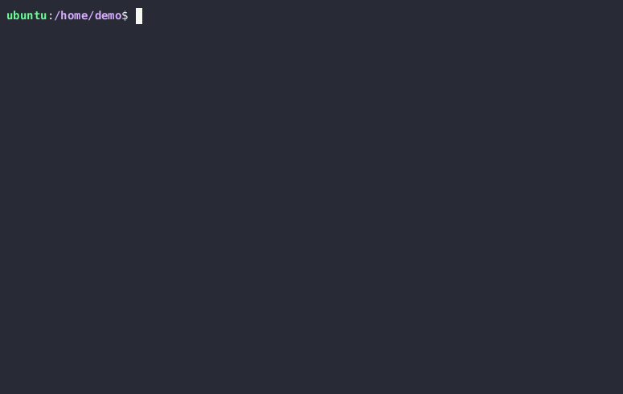

[](https://github.com/gregl83/paq/actions?query=workflow%3ACI+branch%3Amain)
[](https://crates.io/crates/paq)
[](https://github.com/gregl83/paq/blob/master/LICENSE)
# paq

Hash file or directory recursively.

Powered by `blake3` cryptographic hashing algorithm.

<p align="center">
  
</p>

## Performance

The [go](https://github.com/golang/go/commit/8b5fe5980cc116366b37ed8aa83569cadf5772d0) programming language repository was used as a test case (478 MB / 12,540 Files).

| Command | Mean [ms] | Min [ms] | Max [ms] | Relative |
|:---|---:|---:|---:|---:|
| `paq ./go` | 127.8 ± 7.3 | 112.0 | 137.0 | 1.00 |
| `find ./go -type f -print0 \| sort -z \| xargs -0 b3sum \| b3sum` | 172.8 ± 11.3 | 156.3 | 193.8 | 1.35 ± 0.12 |
| `find ./go -type f -print0 \| sort -z \| xargs -0 sha256sum \| sha256sum` | 1610.7 ± 25.3 | 1571.4 | 1649.8 | 12.60 ± 0.74 |

Benchmarked using [hyperfine](https://github.com/sharkdp/hyperfine).

## Installation

### Cargo Install

Installation requires [cargo](https://doc.rust-lang.org/cargo/getting-started/installation.html).

1. Clone this repository.
2. Run `cargo install --path .` from repository root.

### Pre-Built Binary Package

1. Find [Latest Release](https://github.com/gregl83/paq/releases) `.zip` archive for computer Operating System and Architecture.
2. Download and extract `.zip`.
3. Modify permissions of the extracted `paq` binary to allow execution.
4. Move `paq` to system path.

## Usage

Command Line Interface executable or Crate library.

Included in this repository is an [example directory](./example) containing some sample files, a subdirectory and a symlink to test `paq` functionality.

### Executable

Run `paq [src]` to hash source file or directory. 

For help, run `paq --help`.

#### Hash Example Directory

```bash
paq ./example
```

Path to example directory can be relative or absolute.

Expect different results if `-i` or `--ignore-hidden` flag argument is used.

### Crate Library

Add `paq` to project [dependencies](https://doc.rust-lang.org/cargo/reference/specifying-dependencies.html#specifying-dependencies-from-cratesio) in `Cargo.toml`.

#### Use Library

```rust
use paq;

let source = std::path::PathBuf::from("/path/to/source");
let ignore_hidden = true; // .dir or .file
let source_hash: paq::ArrayString<64> = paq::hash_source(&source, ignore_hidden);

println!("{}", source_hash);
```

#### Hash Example Directory

```rust
use paq;

let source = std::path::PathBuf::from("example");
let ignore_hidden = true;
let source_hash: paq::ArrayString<64> = paq::hash_source(&source, ignore_hidden);

assert_eq!(&source_hash[..], "a593d18de8b696c153df9079c662346fafbb555cc4b2bbf5c7e6747e23a24d74");
```

Expect different results if `ignore_hidden` is set to `false`.

## Content Limitations

Hashes are generated using file system content as input data to the `blake3` hashing algorithm.

By design, `paq` does NOT include file system metadata in hash input such as:

- File modes
- File ownership
- File modification and access times
- File ACLs and extended attributes
- Hard links
- Symlink target contents (target path is hashed)

Additionally, files or directory contents starting with dot or full stop *can* optionally be ignored.

## How it Works

1. Recursively get path(s) for a given source argument.
2. Hash each path and file content if path is for a file.
3. Sort the list of hashes to maintain consistent ordering.
4. Compute the final hash by hashing the sorted list of hashes.

## License

[MIT](LICENSE)
